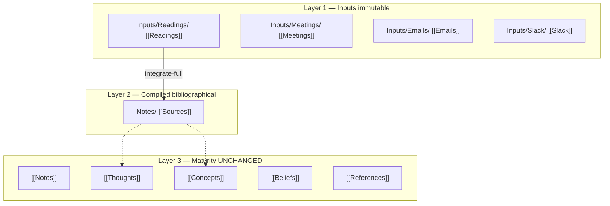

# llm-wiki Architecture

Karpathy's compounding wiki model, adapted to Justin's three-layer vault taxonomy.

## Three layers

## Layer 3 maturity ladder — do not change

Promotion between tiers is governed by **`obsidian-suggest-promotions`** only. llm-wiki does not auto-promote Notes→Thoughts→Beliefs.

| Tier | Category | Role |
|------|----------|------|
| Ephemeral | `[[Notes]]` | Fleeting / operational |
| Opinion | `[[Thoughts]]` | Personal ideas |
| External | `[[Concepts]]` | Others' models (from Sources) |
| Axiom | `[[Beliefs]]` | Trusted principles |
| Pattern | `[[References]]` | Reusable decision patterns |

Parallel (not ladder steps): `[[Decisions]]`, `[[Memories]]`, `[[Projects]]`

## Concepts vs Sources

- **Sources** = canonical bibliographical record per work; metadata + Bes-compiled summary; links down to raw `[[Reading]]`
- **Concepts** = ideas/models extracted from Sources; link up to Source notes, never directly to raw Readings when a Source exists

## Link direction rule

Downstream links upstream:

`[[Concept]]` → `[[Source Title]]` → `[[Reading Title]]`

Never link a Reading directly from a Concept when a Source note exists.

## Integration passes

| Pass | Trigger | Scope |
|------|---------|-------|
| integrate-light | After explicit ingest | `Utilities/log.md`, `Utilities/index.md`, daily notepad |
| integrate-full | Wind-down EIIRP Step 5, manual | Reading→Source, projects, contradictions |
| integrate-query | Interactive Q&A | Durable synthesis → appropriate maturity category |

Cron/autonomous: integrate-light only. No auto-vault from raw streams.

## Boundaries

| Skill | Role |
|-------|------|
| work-log | Daily activity synthesis — not wiki compile |
| obsidian-hygiene | Structural lint — not semantic |
| obsidian-suggest-promotions | Maturity promotion — untouched by llm-wiki |
| bes-email-dispatch | Ingest to inbox/Inputs — then integrate-light |
